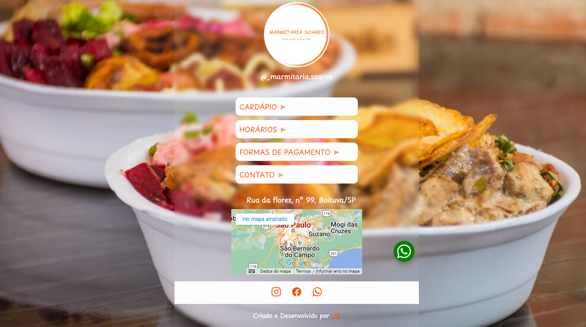
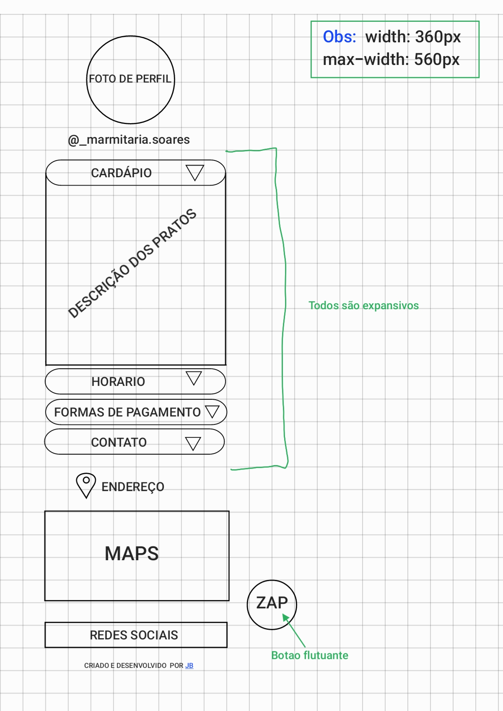

<h1 align="center"> Marmitaria Soares </h1>

    Projeto iniciado para reforçar conhecimentos adquiridos e para ajudar um amigo.

 

  <a href="#-tecnologias">Tecnologias</a>&nbsp;&nbsp;&nbsp;|&nbsp;&nbsp;&nbsp;
  <a href="#-projeto">Projeto</a>&nbsp;&nbsp;&nbsp;|&nbsp;&nbsp;&nbsp;
  <a href="#-layout">Layout</a>&nbsp;&nbsp;&nbsp;|&nbsp;&nbsp;&nbsp;
  <a href="#-mais">Mais</a>&nbsp;&nbsp;&nbsp;|&nbsp;&nbsp;&nbsp;

  

 

##  Tecnologias

Esse projeto foi desenvolvido com as seguintes tecnologias:

- HTML e CSS
- Git e Github
- Rascunho desenhado(xD)

##  Projeto

O Marmitaria Soares é como um cartão de visitas online, com uso inicialmente para redes sociais.

- [Acesse o projeto finalizado, online](https://bit.ly/3tOTq78)

##  Layout

    Aqui foi feito os rascunhos de como eu gostaria que ele fosse, sendo aprovado, começamos os codigos!!

  

##  Mais
Aqui você encontra mais alguns exemplos
- [Mais exemplos HTML e CSS](https://github.com/JonathanGalk/exemplos_html)

